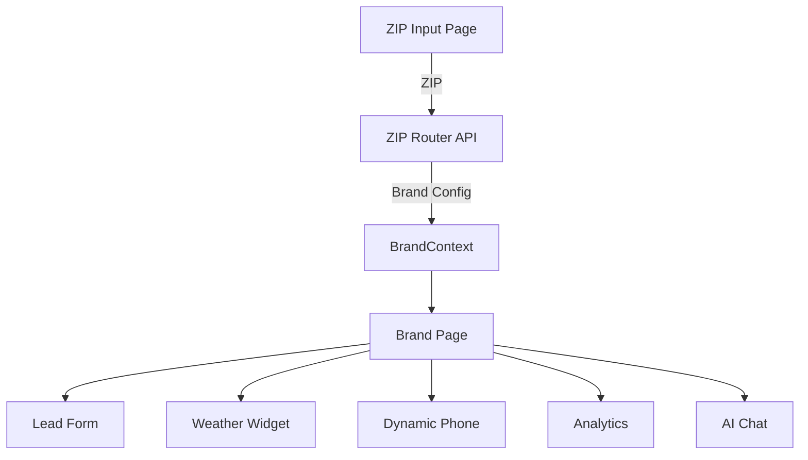
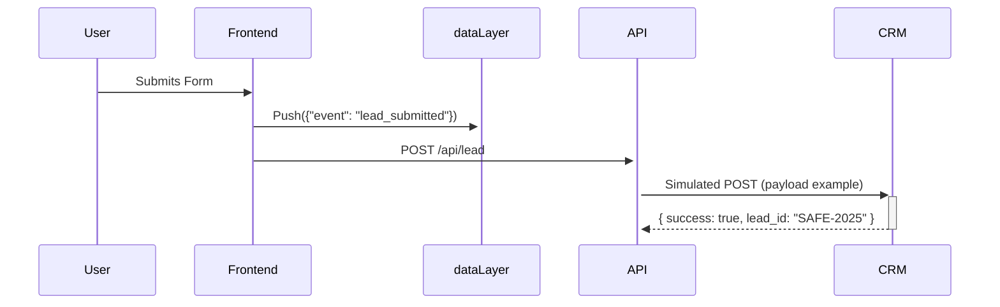

# Security Company Multi-Brand MVP

A mobile-first, multi-brand security company website MVP built with Next.js 14, React, and Tailwind CSS.

---

## 🏗️ Architecture Diagram


---

## 🚀 Features
- Multi-brand architecture with centralized config and overrides
- ZIP-based routing and brand switching
- Progressive lead form with Google Maps Autocomplete
- Weather widget (OpenWeather API)
- Dynamic phone numbers by source (google, valpak, facebook, etc.)
- LocalStorage/sessionStorage form persistence
- Performance optimizations (dynamic imports, image lazy loading)
- GA4/UTM tracking and dataLayer
- **AI Chat Widget**: Placeholder for future AI-based chat to drive leads (@todo)

---

## 🧰 Tools & Libraries
| Tool | Why Chosen | Alternative Considered |
|------|------------|------------------------|
| Next.js 14 | App Router for dynamic routes, built-in API routes | React Router |
| Tailwind CSS | Rapid brand-specific theming via CSS variables | Styled Components |
| React Hook Form | Progressive form enhancement with minimal re-renders | Formik |
| Places Autocomplete | Google Maps address accuracy with type-ahead | Mapbox |

---

## 📁 File Structure
```
src/
├── app/
│   ├── (router)/zip-router/page.jsx
│   ├── (main)/[brand]/page.jsx
│   └── api/lead/route.js
├── components/
│   ├── lead-form.jsx
│   ├── weather-widget.jsx
│   └── ai-chat.jsx
├── context/
│   └── BrandContext.jsx
├── config/
│   └── brands.json
└── utils/
    ├── zipToBrand.js
    ├── storage.js
    └── tracking.js
```

---

## 🔄 CRM Integration


**UTM Capture Example:**
```js
// utils/tracking.js
export const captureUTM = () => {
  const params = new URLSearchParams(window.location.search);
  const utm = { source: params.get('utm_source') };
  sessionStorage.setItem('attribution', JSON.stringify(utm));
};
```

**dataLayer Example:**
```js
window.dataLayer = window.dataLayer || [];
function gtag() { dataLayer.push(arguments); }
gtag('config', 'GA_MEASUREMENT_ID');
```

**@todo:**
- Extend `/api/lead` to support multi-brand CRM routing and payloads

---

## 🧠 Assumptions
1. **Session Storage**: Used `sessionStorage` for temporary form persistence (see `utils/storage.js`). Chosen over cookies for privacy, simplicity, and no cross-domain need in MVP. Cookies can be added for cross-domain attribution if needed.
2. **ZIP Mapping**: Hardcoded state-ZIP ranges (e.g., 320xx-349xx = FL) in `utils/zipToBrand.js`.
3. **API Failures**: Weather widget falls back to error message if OpenWeather API fails.
4. **Analytics**: GA4 event pushing is mocked; real integration is a @todo.
5. **Brand Domains**: Simulated subdomains/brand switching via dynamic routes and could be extended with Vercel rewrites.
6. **No authentication**: MVP is public-facing only.

---

## 🧩 Multi-Brand Architecture
- **Brand Overrides**: Example from `brands.json`:
```json
{
  "SafeHaven": {
    "primaryColor": "#2563eb",
    "ctaText": "Get Protected Today!"
  },
  "BestSecurity": {
    "primaryColor": "#059669",
    "ctaText": "Florida's #1 Security!"
  }
}
```
- **Global Update Mechanism**: BrandContext provides a `switchBrand` function to update the brand globally. All components consuming the context update reactively.

---

## 📝 Form Logic & Analytics
- **Session/Cookie**: Form data is persisted in localStorage/sessionStorage for return visitors (see `utils/storage.js`).
- **UTM Param Capture**: UTM parameters can be captured on page load and stored in sessionStorage for attribution (see CRM Integration section).
- **dataLayer Structure**: Example event push:
```js
dataLayer.push({
  event: 'lead_submitted',
  brand: 'safehaven',
  utm_source: 'google',
  zip: '28201'
});
```
- **Dynamic Phone Mapping**: supports `google`, `valpak`, `facebook`, and default. To extend, add to the `phoneMap` in `[brand]/page.jsx`.
- **@todo:**
  - Add ARIA labels and further accessibility improvements to all forms and interactive elements.
  - Add ZIP suggestion/autocomplete to the lead form (currently only address autocomplete is implemented).

---

## 🛠️ Performance Optimization
- **Dynamic Imports**: WeatherWidget and LeadForm are loaded only when needed (see `[brand]/page.jsx`).
- **Image Lazy Loading**: Use Next.js `<Image />` for all images (add as needed).
- **Tailwind Purge**: Tailwind CSS purge is enabled in `tailwind.config.js` for production builds.
- **Minimal JS**: Only essential client-side JS is shipped.
- **API Error Handling**: All API calls have loading and error states.
- **Bundle Size**: Check with `next build` and `next analyze` for bundle metrics. Dynamic imports and code splitting keep the bundle lean.
- **No layout shifts (CLS)**: Use semantic HTML and Tailwind utilities. @todo: Add ARIA labels for full accessibility.
- **Total page weight**: Target under 1.2MB (check with browser dev tools).
- **Gzip/compression**: Enabled by default in Next.js.

---

## 📊 Tracking & Analytics
- `dataLayer` object is initialized in `_app.js` or `layout.js` for GA4.
- UTM parameters are captured from the URL and pushed to `dataLayer`.
- GTM script should be injected in `app/layout.js` (head section) for Next.js App Router.

---

## 💡 Tech Insight: SMS Retargeting with Twilio
- Integrate Twilio API to send SMS to leads who abandon the form.
- Trigger SMS via serverless function when partial form data is detected.
- Use opt-in checkbox for compliance.
- Track SMS clicks and conversions in analytics.

---

## 🏠 Homepage Routing
- The `/` route should display the SafeHaven (default brand) homepage. @todo: Add a redirect or render logic in the main app router to ensure this behavior.

